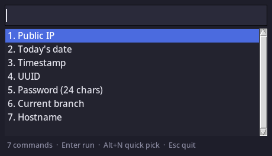

* quickkey
/(said like "quickie")/

A keystroke-launched menu of commands. Hit your hotkey, a small window pops
up, you pick an entry by clicking or typing, the command runs, and its
stdout is waiting on your clipboard.

Pure standard library -- Python 3 with tkinter. The only outside dependency
is a clipboard helper (=xclip=, =xsel=, =wl-copy=, or =pbcopy=), which you
almost certainly already have.

** Install
*** Arch Linux
It is on the AUR as
[[https://aur.archlinux.org/packages/quickkey][=quickkey=]]:

#+begin_src sh
paru -S quickkey        # or: yay -S quickkey
#+end_src

Or without a helper:

#+begin_src sh
git clone https://aur.archlinux.org/quickkey.git
cd quickkey && makepkg -si
#+end_src

Either way you get =/usr/bin/quickkey=, a systemd *user* unit, and a
fallback config at =/usr/share/quickkey/quickkey.conf=.

#+begin_src sh
systemctl --user enable --now quickkey.service   # keep it warm (see Speed)
#+end_src

The =PKGBUILD= in this repo is the same one the AUR carries: it builds the
tagged release tarball from GitHub, not your working tree. To package an
unreleased change, tag it first. Releasing:

#+begin_src sh
git tag -a v1.2.3 -m 'quickkey 1.2.3' && git push origin v1.2.3
rm -f *.tar.gz && updpkgsums          # a cached tarball will be re-hashed
makepkg --printsrcinfo > .SRCINFO     # the AUR rejects a stale .SRCINFO
#+end_src

then commit =PKGBUILD= and =.SRCINFO= to the AUR repo.

*** Debian / Ubuntu
Build the =.deb= from a checkout:

#+begin_src sh
sudo apt install build-essential debhelper devscripts
dpkg-buildpackage -us -uc -b
sudo apt install ../quickkey_1.0.0-1_all.deb
#+end_src

Same layout as the Arch package.  =python3-tk= is a hard dependency:
Debian splits tkinter out of =python3=, and without it the program cannot
start.

*** Any platform, with pip
The PyPI distribution is =quickkey-menu=, because =quickkey= was already
taken by an unrelated project.  The installed command is still =quickkey=:

#+begin_src sh
pipx install quickkey-menu      # or: pip install --user quickkey-menu
#+end_src

Two things pip cannot do for you.  It installs no config, so create
=~/.config/quickkey/config= yourself (see [[*Config][Config]]); and it cannot
install tkinter, which many distros package separately -- =python3-tk= on
Debian and Ubuntu, =python3-tkinter= on Fedora, =tk= on Arch.  No systemd
unit is installed either; copy =quickkey.service= from the repo and point
=ExecStart= at the installed =quickkey=.

*** Anywhere else
There is nothing to build -- drop =quickkey.py= somewhere on your =PATH=.

** Tests
=tests/regress.py= drives the real Tk widgets and the real clipboard, so it
needs a display.  On a headless machine:

#+begin_src sh
xvfb-run -a python3 tests/regress.py
#+end_src

** Config
INI format. Each section name is what shows up in the menu; =command= is run
through the shell.

#+begin_src ini
[Public IP]
command = curl -s https://ifconfig.me

[UUID]
command = cat /proc/sys/kernel/random/uuid

[Password (24 chars)]
command = tr -dc 'A-Za-z0-9!@#$%^&*' < /dev/urandom | head -c 24
#+end_src

quickkey looks for the config in this order:

1. =$QUICKKEY_CONFIG=
2. =~/.config/quickkey/config= (then =config.ini=)
3. =~/.quickkeyrc=
4. =quickkey.conf= next to the script
5. =/etc/quickkey/config=
6. =/usr/share/quickkey/quickkey.conf= (shipped by the package)

=quickkey.conf= in this repo is a starter -- copy it into place:

#+begin_src sh
mkdir -p ~/.config/quickkey
cp quickkey.conf ~/.config/quickkey/config
#+end_src

** Keys
| Key                                | Action                                      |
|------------------------+------------------------------|
| type anything                      | filter the list                             |
| type a number                      | jump to that entry (=4= puts item 4 on top) |
| =Up= / =Down=, =Ctrl-p= / =Ctrl-n= | move                                        |
| =PgUp= / =PgDn=, =Home= / =End=    | jump                                        |
| =Enter=                            | run the selection and copy its output       |
| =Alt-1= ... =Alt-9=                | run that numbered entry directly            |
| =Esc=, =Ctrl-q=                    | quit without doing anything                 |

Single click selects, double click runs.

The window closes itself once something is copied. Pass =-k= to keep it open
for copying several things in a row.

** Speed
Cold, it is about 60 ms from exec to a window on screen -- roughly 45 ms of
that is Tk building itself, which no amount of tuning inside the script will
recover. To get out of that entirely, leave one resident:

#+begin_src sh
quickkey --daemon &
#+end_src

It builds the window, hides it, and waits on a unix socket. A later bare
=quickkey= notices the socket, hands off, and exits -- about *20 ms*, and
the already-built window just un-hides. Bind the hotkey to plain =quickkey=
either way: with no daemon running it draws its own window as usual, so the
same binding works whether or not the daemon is up.

The daemon re-reads the config whenever the file's mtime changes, so editing
your commands does not mean restarting it.

Only a bare =quickkey= hands off. Anything with flags (=quickkey -k=) draws
its own window, since the resident one was built with its own options and
silently ignoring yours would be worse.

The package ships =quickkey.service= for this:

#+begin_src sh
systemctl --user enable --now quickkey.service
#+end_src

It is a /user/ unit -- =--user= is not optional. A plain
=systemctl enable quickkey= talks to the system manager and reports "Unit
quickkey.service could not be found" even though the file is installed; so
does =systemctl status quickkey=. Always pass =--user=.

It installs into =default.target=, not =graphical-session.target=. The
latter reads better, but many X setups (startx, bare window managers, some
display managers) never activate it, and a unit wanted by an inactive target
silently never starts. Check yours with:

#+begin_src sh
systemctl --user is-active graphical-session.target
#+end_src

If it says =active=, either target works. The unit is still /ordered/ after
it, and retries for a minute if the display is not up yet.

If the service starts but the hotkey never reaches it, your session probably
did not export =DISPLAY= into the systemd user manager. Check with
=systemctl --user show-environment=; most desktops populate it, and
otherwise:

#+begin_src sh
dbus-update-activation-environment --systemd DISPLAY WAYLAND_DISPLAY XAUTHORITY
#+end_src

Running from a checkout instead of the package? Copy the unit to
=~/.config/systemd/user/= and point =ExecStart= at your =quickkey.py=.

** Bind it to a hotkey
The script is the whole program -- point your window manager at it.

*i3 / sway*

#+begin_example
bindsym $mod+c exec --no-startup-id /home/ghollisjr/myprogs/quickkey/quickkey.py
#+end_example

*xbindkeys* (=~/.xbindkeysrc=, works under most X11 setups)

#+begin_example
"/home/ghollisjr/myprogs/quickkey/quickkey.py"
  Mod4 + c
#+end_example

*GNOME*: Settings → Keyboard → Custom Shortcuts → add the script's path.

*KDE*: System Settings → Shortcuts → Custom Shortcuts → new global shortcut
running the script.

** Options
#+begin_example
-c, --config PATH   use this config file
    --selection S   which X selection to write: both (default), clipboard,
                    or primary
    --daemon        stay resident; later bare runs pop this window up
    --no-daemon     draw our own window even if a daemon is running
-k, --keep-open     stay open after copying instead of exiting
-t, --timeout SECS  give up on a command after this long (default 30, 0 = never)
    --no-strip      keep leading/trailing newlines in the copied text
    --list          print the configured names and commands, then exit
    --title TEXT    window title
#+end_example

** Notes
X11 has two independent selections, and applications disagree about which
one "paste" means.  =CLIPBOARD= is what Ctrl-V reads; =PRIMARY= is what
middle-click pastes, and what =Shift-Insert= reads in rxvt-unicode, xterm
and most other terminals.  quickkey writes *both* by default, so the same
copy works whichever one the target application asks for.

If you would rather it left your mouse selection alone, =--selection
clipboard= writes only =CLIPBOARD=.  The status line in =-k= mode names
the selections it wrote.  On macOS and Windows there is only one
clipboard, and the extra selection is skipped.

Nothing is printed on the way out -- on a successful copy the window just
goes, since a confirmation you cannot read before it disappears is only a
flash. Run with =-k= if you want to see what was copied.

Trailing newlines are stripped from the output before copying, so
=date=-style one-liners paste cleanly. Use =--no-strip= if you want the
bytes verbatim.

If a command exits non-zero, nothing is copied -- the last line of its
stderr shows in the status bar instead and the window stays put.

Commands run in a background thread, so a slow one doesn't freeze the
window.
